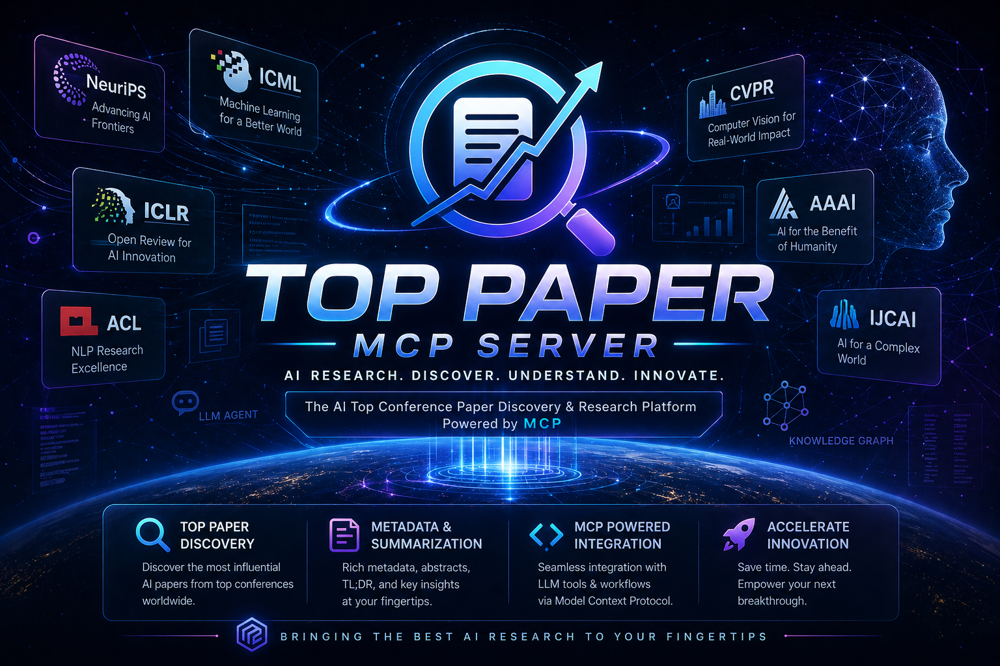

[](https://pypi.org/project/top-paper-mcp-server/)
[](https://pypi.org/project/top-paper-mcp-server/)
[](https://www.python.org/downloads/)
[](https://opensource.org/licenses/Apache-2.0)

**English** | [中文](README_CN.md)

# Top Paper MCP Server



> 🔍 Enable AI assistants to search and access academic papers from arXiv and top conferences through a simple MCP interface.

The Top Paper MCP Server provides a bridge between AI assistants and academic research repositories through the Model Context Protocol (MCP). It allows AI models to search for papers and access their content in a programmatic way.

**This project is a fork of [arxiv-mcp-server](https://github.com/blazickjp/arxiv-mcp-server) that retains full arXiv support and adds extended conference search capabilities.**

<div align="center">
  
🤝 **[Contribute](CONTRIBUTING.md)** • 
📝 **[Report Bug](https://github.com/doubletwo123/top-paper-mcp-server/issues)**

</div>

## ✨ Core Features

### arXiv Integration
- 🔎 **Paper Search**: Query arXiv papers with filters for date ranges and categories
- 📄 **Paper Access**: Download and read paper content
- 📋 **Paper Listing**: View all downloaded papers
- 🗃️ **Local Storage**: Papers are saved locally for faster access

### Conference Support
- 🔎 **Dual-Path Conference Search**: Searches both arXiv and OpenReview in parallel, then merges results — arXiv provides full paper content (abstracts, PDFs) while OpenReview provides conference venue metadata
- 📄 **Conference Download**: Download papers via OpenReview API with arXiv fallback
- 📝 **Prompts**: Research prompts for paper analysis

### HuggingFace Integration
- 📊 **Daily Papers**: Fetch trending papers curated by the HuggingFace community each day
- 🪞 **Metadata Mirror**: Fallback metadata source when arXiv API is congested (provides title, abstract, authors, upvotes, AI summary, GitHub links)

## Supported Conferences

All conferences are searched via **dual-path**: arXiv (content) + OpenReview (conference metadata) in parallel.

| Conference | arXiv Category | Year Range |
|------------|---------------|------------|
| **Computer Vision** |
| CVPR | cs.CV | 2000-present |
| ICCV | cs.CV | 2000-present |
| WACV | cs.CV | 2000-present |
| ECCV | cs.CV | 2000-present |
| **Machine Learning / AI** |
| ICLR | cs.LG, cs.AI, cs.CL | 2000-present |
| NeurIPS | cs.LG, cs.AI, cs.CL, stat.ML | 2000-present |
| ICML | cs.LG, stat.ML | 2000-present |
| AAAI | cs.AI | 2000-present |
| IJCAI | cs.AI | 2000-present |
| COLM | cs.CL, cs.LG | 2000-present |
| CoRL | cs.RO, cs.LG, cs.AI | 2000-present |
| MLSYS | cs.LG, cs.DC | 2020-present |
| **NLP** |
| ACL | cs.CL | 2000-present |
| EMNLP | cs.CL | 2000-present |
| NAACL | cs.CL | 2000-present |
| **Speech / Multimodal** |
| INTERSPEECH | eess.AS, cs.CL | 2000-present |
| IWSLT | cs.CL | 2000-present |
| MICCAI | cs.CV, eess.IV | 2000-present |

## 🚀 Quick Start

### Installing via Smithery

```bash
npx -y @smithery/cli install top-paper-mcp-server --client claude
```

### Manual Installation

```bash
uv tool install top-paper-mcp-server
```

For PDF support (older papers):

```bash
uv tool install 'top-paper-mcp-server[pdf]'
```

Verify installation:

```bash
top-paper-mcp-server --help
```

### MCP Configuration

```json
{
    "mcpServers": {
        "top-paper": {
            "command": "uv",
            "args": [
                "tool",
                "run",
                "top-paper-mcp-server",
                "--storage-path", "/path/to/paper/storage"
            ]
        }
    }
}
```

For development:

```json
{
    "mcpServers": {
        "top-paper": {
            "command": "uv",
            "args": [
                "--directory",
                "path/to/cloned/top-paper-mcp-server",
                "run",
                "top-paper-mcp-server",
                "--storage-path", "/path/to/paper/storage"
            ]
        }
    }
}
```

### HTTP Transport

```bash
TRANSPORT=http HOST=127.0.0.1 PORT=8080 top-paper-mcp-server --storage-path /path/to/papers
```

Then configure your MCP client:

```json
{
    "mcpServers": {
        "top-paper": {
            "type": "http",
            "url": "http://127.0.0.1:8080/mcp"
        }
    }
}
```

## 💡 Available Tools

### arXiv Tools

```python
# Search arXiv papers
result = await call_tool("search_papers", {
    "query": "transformer",
    "max_results": 10,
    "categories": ["cs.LG", "cs.AI"]
})

# Download a paper
result = await call_tool("download_paper", {
    "paper_id": "2401.12345"
})

# List downloaded papers
result = await call_tool("list_papers", {})

# Read paper content
result = await call_tool("read_paper", {
    "paper_id": "2401.12345"
})
```

### Conference Tools

```python
# Search single conference (dual-path: arXiv + OpenReview in parallel)
result = await call_tool("conference_search", {
    "query": "object detection",
    "conference": "CVPR",
    "year": 2024,
    "max_results": 10
})

# Multi-conference concurrent search
result = await call_tool("conference_search", {
    "query": "transformer",
    "conference": "NeurIPS",
    "year": 2024,
    "search_all": True,
    "conferences": ["CVPR", "NeurIPS", "ICLR", "ICML"]
})

# Search by category with concurrent execution
result = await call_tool("conference_search", {
    "query": "attention",
    "conference": "NeurIPS",
    "year": 2024,
    "search_all": True,
    "categories": ["computer_vision", "nlp"]
})

# Unified search across ALL conferences
result = await call_tool("unified_search", {
    "query": "deep learning",
    "year": 2024,
    "max_results_per_conference": 5,
    "total_results": 20
})

# Download conference paper (OpenReview API with arXiv fallback)
result = await call_tool("conference_download", {
    "paper_id": "12345",
    "conference": "CVPR"
})
```

#### Dual-Path Search Architecture

- **Dual-Path**: Each conference query runs arXiv search and OpenReview search concurrently
- **Result Merging**: Results are merged by title matching — OpenReview papers (with conference metadata) are primary, arXiv-only papers are supplementary
- **Enrichment**: When a paper is found on both sources, the result includes arXiv content (abstracts, PDFs) plus OpenReview conference metadata
- **Priority-Based Ordering**: Results sorted by conference priority (CVPR > NeurIPS > ICLR > ICML > ...)
- **Category Filtering**: Filter by domain (computer_vision, machine_learning, nlp, ai, speech, medical, theory)
- **Concurrent Execution**: Searches multiple conferences in parallel using asyncio with semaphore (max 10)
- **Timeout Protection**: Individual requests timeout after 30 seconds
- **Automatic Retry**: Failed requests retry up to 2 times with exponential backoff

### HuggingFace Tools

```python
# Fetch HuggingFace daily papers (trending papers curated by HF community)
result = await call_tool("hf_daily_papers", {
    "date": "2024-01-15",    # optional, defaults to today
    "max_results": 20        # optional, default 20, max 100
})
```

HuggingFace integration also provides a metadata mirror for arXiv papers — when the arXiv API is congested, paper metadata (title, abstract, authors, upvotes, AI summary, GitHub links) can be fetched from HuggingFace's paper API as a fallback.

## ⚙️ Configuration

| Setting | Purpose | Default |
|---------|---------|---------|
| `--storage-path` | Paper storage location | `~/.top-paper-mcp-server/papers` |
| `MAX_RESULTS` | Maximum search results | `50` |
| `REQUEST_TIMEOUT` | API timeout in seconds | `60` |
| `TRANSPORT` | Transport type: `stdio`, `http` | `stdio` |
| `HOST` | Host to bind to in HTTP mode | `127.0.0.1` |
| `PORT` | Port to listen on in HTTP mode | `8000` |

## 🔒 Security

**Paper content retrieved from external sources is untrusted input.**

When an AI assistant downloads or reads a paper through this server, the paper's
text is passed directly into the model's context. A maliciously crafted paper
could embed adversarial instructions designed to hijack the AI's behavior.

### Recommended Mitigations

1. Use read-only MCP configurations when possible
2. Review paper content before acting on AI summaries
3. Be cautious in multi-tool setups
4. Treat AI-generated summaries as data, not instructions

## 🧪 Testing

```bash
python -m pytest
```

## 📄 License

Released under the Apache License 2.0. See the LICENSE file for details.

---

## 🙏 Acknowledgments

This project is a fork of **[arxiv-mcp-server](https://github.com/blazickjp/arxiv-mcp-server)** created by **[Joseph Blazick](https://github.com/blazickjp)**, with additional features and conference support added by **doubletwo123**.

We sincerely thank:
- **Joseph Blazick** for creating the original arxiv-mcp-server and making it open source
- The **arXiv** team for providing the open research repository
- **OpenReview** for enabling open access to peer reviews
- **CVF/ECVA** for providing open access to computer vision conference papers
- All the conference organizers who make their papers publicly accessible

This project extends the original work to support additional top academic conferences while maintaining compatibility with the existing arXiv functionality.

---

<div align="center">

Made with ❤️ for academic research

</div>